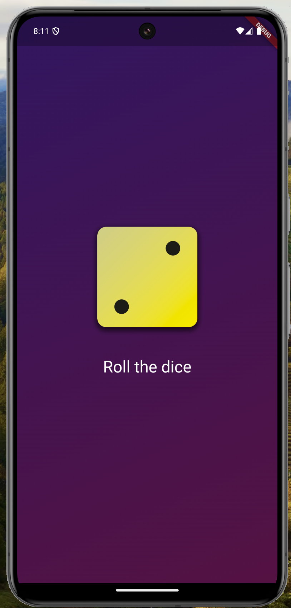

# 🎲 Flutter Dice Roller App

A simple dice-rolling mobile app — built as a personal project to explore Flutter app development.

 <!-- optional if you add a screenshot -->

---

## 🛠️ Technologies

- **Flutter**
- **Dart**

---

## 🚀 Features

- Tap-to-roll interactive dice
- Random dice logic using Dart
- Stateless and Stateful widget practice
- Themed layout with responsive UI

---

## 📚 What I Learned

- Flutter app architecture and folder structure
- Managing state and building widget trees
- Hot reload and development workflow
- Reusable components in Flutter (custom widgets)

---

## 📦 Getting Started

To run the app locally:

```bash
git clone https://github.com/yurnero14/flutter-dice-roller.git
cd flutter-dice-roller/first_app
flutter pub get
flutter run
